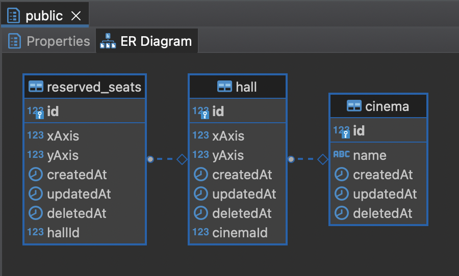

## README - Cinema Ticketing System API

Project Overview
This project implements a ticketing system API for a cinema. The system enforces social distancing by ensuring an empty seat next to each occupant in all four directions. The core functionality is provided by the getNextAvailableTicket API, which allocates seats based on availability and preferred seating within a rectangular cinema hall of X rows and Y seats per row.

## Features

Social Distancing Compliance: Ensures a vacant seat adjacent to every occupied seat in all 4 directions.
Preferred Seating Option: Allows users to specify a preferred seat and allocates it if available. If the preferred seat is occupied, the system allocates the closest available seat, prioritizing proximity to the center of the hall.
Default Middle Allocation: In the absence of a preferred seat, the system starts seat allocation from the middle of the cinema hall.

## Installation

```bash
$ npm install
```

## Running the app

```bash
# development
$ npm run start

# watch mode
$ npm run dev
```

## Test

```bash
# unit tests
$ npm run test

# e2e tests
$ npm run test:e2e

# test coverage
$ npm run test:cov
```

## Database choice: Postgres



Postgres in RDS
Easier, managed deployments. Fast, predictable storage. Backup and recovery. High availability and read replicas.Isolation and security

If the db have issues in the future, we can change to NoSQL database. NoSQL databases are generally more scalable and provide superior performance for large-scale applications. They can handle large volumes of data and high user loads with ease. (DynamoDB)

## ORM choice: TypeORM

TypeORM
Easy to integrate with NestJS

## IaC choice: Serverless Framework

Serverless Framework
Deploy serverless API to AWS Lambda easily with the Serverless Framework.

## Cloud choice: AWS

AWS

## CI/CD choice: Github Actions

Github Actions

## Calling the API

### Get next available ticket local

With no Prefered Seats

```bash
http://localhost:3001/reserved-seat/nextAvailableTicket?hallId=1
```

With Prefered Seats

```bash
http://localhost:3001/reserved-seat/nextAvailableTicket?hallId=1&xAxis=9&yAxis=0
```

### Get next available ticket deployed

```bash
https://c1i0ye43g5.execute-api.us-east-1.amazonaws.com/dev/reserved-seat/nextAvailableTicket/?hallId=1
```

```bash
https://c1i0ye43g5.execute-api.us-east-1.amazonaws.com/dev/reserved-seat/nextAvailableTicket/?hallId=1&xAxis=1&yAxis=1
```
